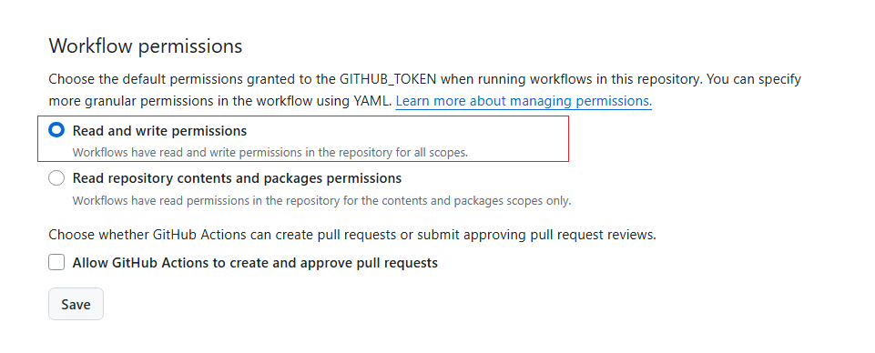

# 项目来由
clone 某个项目,修改某些文件,然后打出镜像并推送

## 问题
解决failed to put manifest ghcr.io/usernameisnull/mongodb-kubernetes-operator:latest: denied: permission_denied: write_package

[Permissions required for GitHub Apps.](https://docs.github.com/en/repositories/managing-your-repositorys-settings-and-features/enabling-features-for-your-repository/managing-github-actions-settings-for-a-repository#setting-the-permissions-of-the-github_token-for-your-repository)

改成如下的即可


可能如下的permissions也起作用了
```ymal
jobs:
  release-single-image:
    runs-on: ubuntu-latest
    permissions:
      contents: read
      packages: write
```
